# Informe Técnico Fase 2: Vuelos BI con Power BI

##### _Laboratorio de seminario de sistemas 2 - 2S26_
---
* Grupo 21 
#### Melvin Alexander Valencia Estrada - 202111556
#### Giovanni Saul Concohá Cax - 202100229
---
## 1. Introducción

Este informe documenta el diseño, la implementación y la justificación estratégica de la
solución de Inteligencia de Negocios (Business Intelligence) construida sobre la base de datos
**VuelosBI**, correspondiente a la segunda fase de la práctica del curso. Mientras que la primera
fase se centró en el diseño del modelo dimensional en SQL Server y en el proceso ETL que carga
los datos, esta fase se enfoca en transformar ese modelo relacional en un **modelo tabular analítico dentro de Power BI Desktop**, sobre el cual se construyeron medidas DAX, indicadores
clave de desempeño (KPIs) y un dashboard interactivo.

El objetivo de este documento es explicar **qué se construyó, cómo se construyó y por qué**,
de manera que sirva tanto como evidencia técnica de la práctica como de guía de lectura del
dashboard final para cualquier usuario de negocio.

### 1.1 Contexto respecto a la Fase 1

El modelo de datos, el proceso ETL y el esquema en estrella fueron documentados en detalle en la
Fase 1 del proyecto y no se repiten aquí en profundidad. Cabe mencionar únicamente que, para esta
fase, el motor de **SQL Server se ejecuta mediante una instalación local** en lugar del contenedor
Docker utilizado originalmente; el esquema, las tablas, las relaciones y los datos cargados son
exactamente los mismos, por lo que este cambio de infraestructura no tiene ningún impacto sobre
el modelo tabular ni sobre los resultados analíticos descritos en este informe.

para la creación local de la base de datos se utilizo el .bat en `../BaseDatos/init_db.bat`

```bat
@echo off
echo Esperando a SQL Server...
timeout /t 30

sqlcmd -S localhost -U sa -P "Pass@WordSEMI2g21!" -C -N -d master -i "C:\Users\gios\Desktop\semi2lab\SS22S2026_grupo21\Practica2\BaseDatos\init.sql"

echo Script ejecutado correctamente.
pause
```

| Comando  | Explicación  |
|-|-|
| **@echo off**  | Oculta los comandos en la consola, mostrando solo los mensajes que tú escribes. |
| **timeout /t 30**  | Pausa la ejecución durante 30 segundos, dando tiempo a que SQL Server arranque. |
| **sqlcmd**   | Cliente de línea de comandos de SQL Server para ejecutar consultas y scripts. |
| **-S localhost**    | Indica el servidor al que conectarse. En este caso, `localhost` (máquina local). |
| **-U sa**     | Usuario de SQL Server. Aquí se usa el administrador `sa`. |
| **-P "contrasenia"**  | Contraseña del usuario `sa`. |
| **-C**   | Confía en el certificado SSL del servidor (TrustServerCertificate). |
| **-N**    | Fuerza la conexión cifrada (Encryption = true). |
| **-d master**  | Base de datos inicial a la que se conecta antes de ejecutar el script. |
| **-i "C:\ruta\init.sql"** | Especifica el archivo `.sql` que contiene las instrucciones a ejecutar. |
| **pause** | Detiene la ejecución y espera que el usuario presione una tecla para cerrar la ventana. |

---

## 2. Conexión y diseño del modelo tabular

### 2.1 Conexión a la fuente de datos

Power BI Desktop se conectó directamente al motor SQL Server local mediante el conector nativo
**SQL Server** (`Obtener datos -> Base de datos -> SQL Server`) utilizando modo de conectividad:

#### obtener datos:
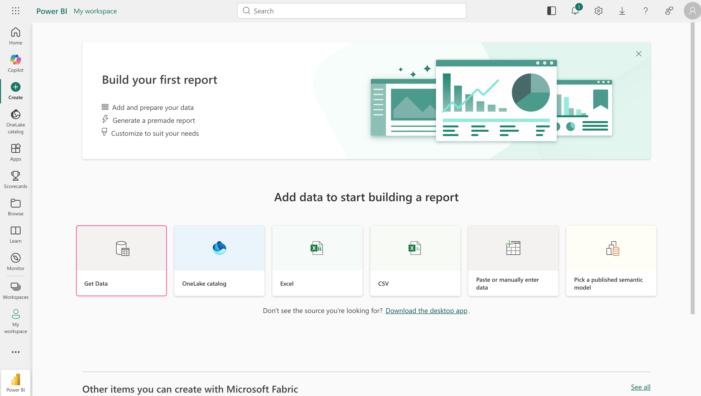

#### Base de datos, SQL server:
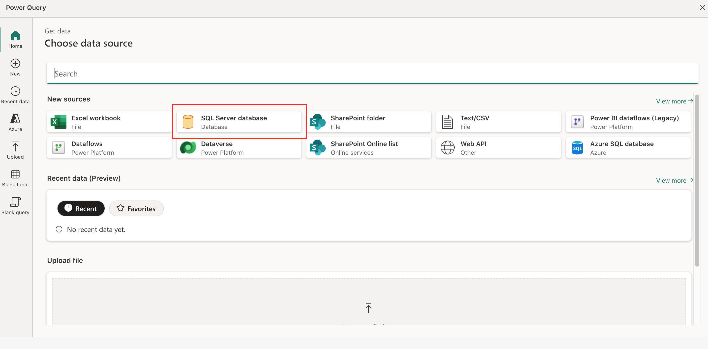

#### Credenciales para la base de datos:
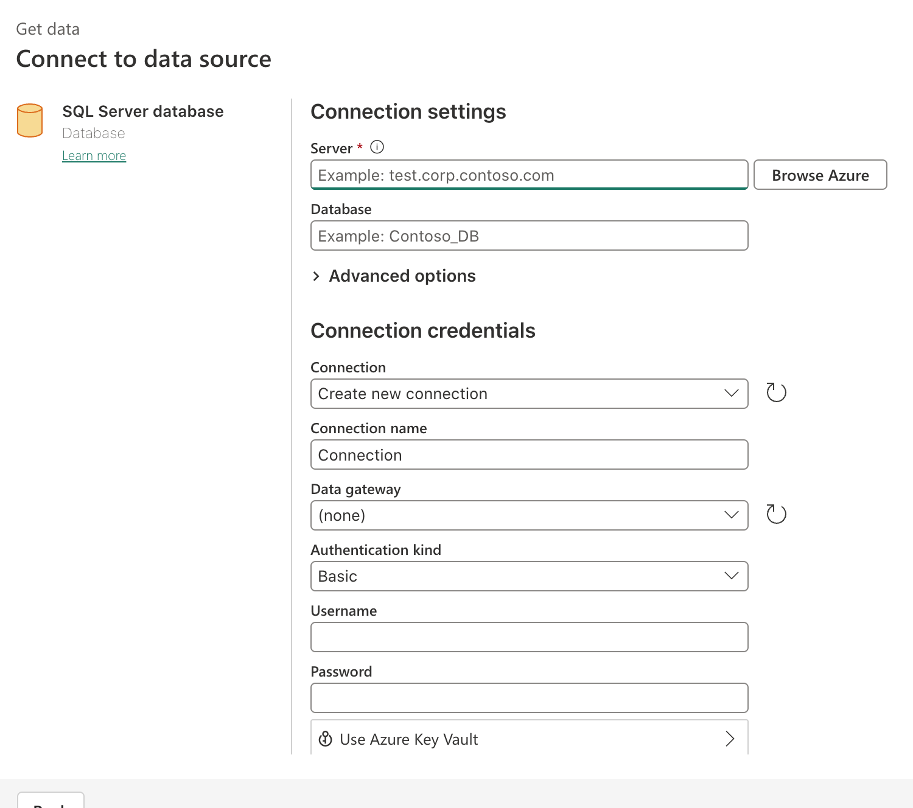

 
**Import**, con el cual las 10 tablas del modelo dimensional (`Fact_Vuelos` y las 9 dimensiones)
fueron cargadas por completo a la memoria de Power BI. Se optó por modo Import en lugar de
DirectQuery porque el volumen de datos (10,000 hechos, tablas de dimensión pequeñas) es reducido y
porque el modo Import permite un rendimiento notablemente superior al calcular medidas DAX, al
trabajar sobre el motor analítico en memoria (VertiPaq) en lugar de traducir cada interacción del
usuario en una consulta SQL en tiempo real.

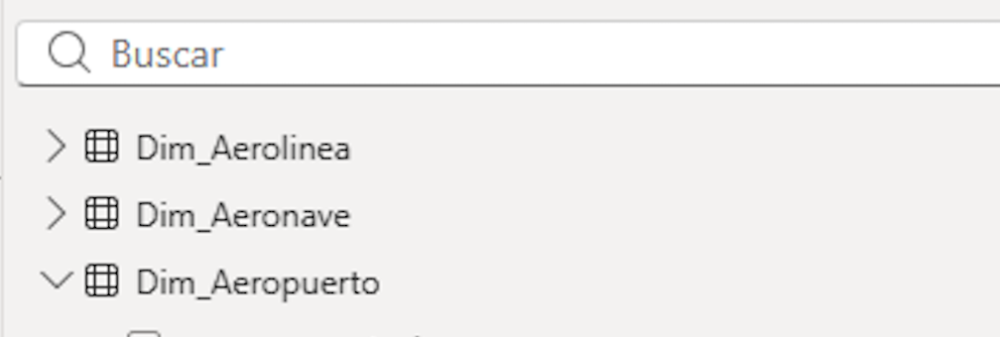


### 2.2 Tablas cargadas

| Tabla | Tipo | Contenido |
|---|---|---|
| `Fact_Vuelos` | Hecho | Un registro por vuelo/boleto vendido (10,000 filas) |
| `Dim_Aerolinea` | Dimensión | Aerolíneas (12) |
| `Dim_Aeropuerto` | Dimensión de doble rol | Aeropuertos (15), usada como origen y como destino |
| `Dim_Aeronave` | Dimensión | Tipos de aeronave (12) |
| `Dim_ClaseCabina` | Dimensión | Clases de cabina (4) |
| `Dim_Pasajero` | Dimensión | Pasajeros únicos (10,000) |
| `Dim_CanalVenta` | Dimensión | Canales de venta (6) |
| `Dim_MetodoPago` | Dimensión | Métodos de pago (5) |
| `Dim_EstadoVuelo` | Dimensión | Estados del vuelo (4) |
| `Dim_Fecha` | Dimensión de doble rol | Calendario (861 fechas), usada como fecha de salida y fecha de reserva |

### 2.3 Modelo de relaciones

El modelo tabular replica fielmente el esquema en estrella diseñado en la Fase 1. Todas las
relaciones entre `Fact_Vuelos` y sus dimensiones son de cardinalidad **muchos a uno (\*:1)** con
dirección de filtro **única** (de la dimensión hacia el hecho), que es la configuración estándar y
recomendada para un esquema en estrella: cada dimensión filtra al hecho, nunca al revés.

| Relación | Cardinalidad | Dirección de filtro |
|---|---|---|
| `Fact_Vuelos` -> `Dim_Aerolinea` | *:1 | Única |
| `Fact_Vuelos` -> `Dim_Aeronave` | *:1 | Única |
| `Fact_Vuelos` -> `Dim_Aeropuerto` (origen) | *:1 | Única |
| `Fact_Vuelos` -> `Dim_Aeropuerto` (destino) | *:1 | Única |
| `Fact_Vuelos` -> `Dim_ClaseCabina` | *:1 | Única |
| `Fact_Vuelos` -> `Dim_Pasajero` | *:1 | Única |
| `Fact_Vuelos` -> `Dim_CanalVenta` | *:1 | Única |
| `Fact_Vuelos` -> `Dim_MetodoPago` | *:1 | Única |
| `Fact_Vuelos` -> `Dim_EstadoVuelo` | *:1 | Única |
| `Fact_Vuelos` -> `Dim_Fecha` (reserva) | *:1 | Única (**activa**) |
| `Fact_Vuelos` -> `Dim_Fecha` (salida) | *:1 | Única (**inactiva**) |
| `Fact_Vuelos` -> `Dim_Aeropuerto` (la segunda relación de origen/destino) | *:1 | Única (**inactiva**) |

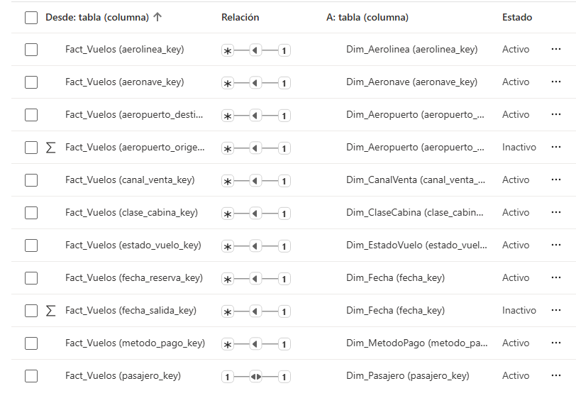


#### 2.3.1 Dimensiones de rol múltiple (*role-playing dimensions*)

Dos dimensiones del modelo cumplen más de un papel lógico dentro del hecho, y Power BI, al igual
que cualquier motor tabular, solo permite **una ruta de filtrado activa** entre dos mismas
tablas. Por esa razón, en ambos casos una de las dos relaciones queda **inactiva**:

- **`Dim_Aeropuerto`**: se relaciona con `Fact_Vuelos` tanto por `aeropuerto_origen_key` como por
  `aeropuerto_destino_key`. La relación de **destino** se dejó activa (es la que se utiliza por
  defecto en los visuales de destinos y rutas); la de **origen** queda inactiva.
- **`Dim_Fecha`**: se relaciona con `Fact_Vuelos` tanto por `fecha_reserva_key` como por
  `fecha_salida_key`. La relación de **reserva** se dejó activa; la de **salida** queda inactiva.

Las relaciones inactivas no desaparecen del modelo: se activan puntualmente dentro de una medida
DAX mediante la función `USERELATIONSHIP()`, cuando se necesita analizar un hecho desde el otro
rol de la dimensión (por ejemplo, calcular ingresos por fecha de **salida del vuelo** en lugar de
por fecha de **reserva del boleto**).

vista de modelo de Power BI, diagrama completo de relaciones, incluyendo las líneas punteadas de las relaciones inactivas.

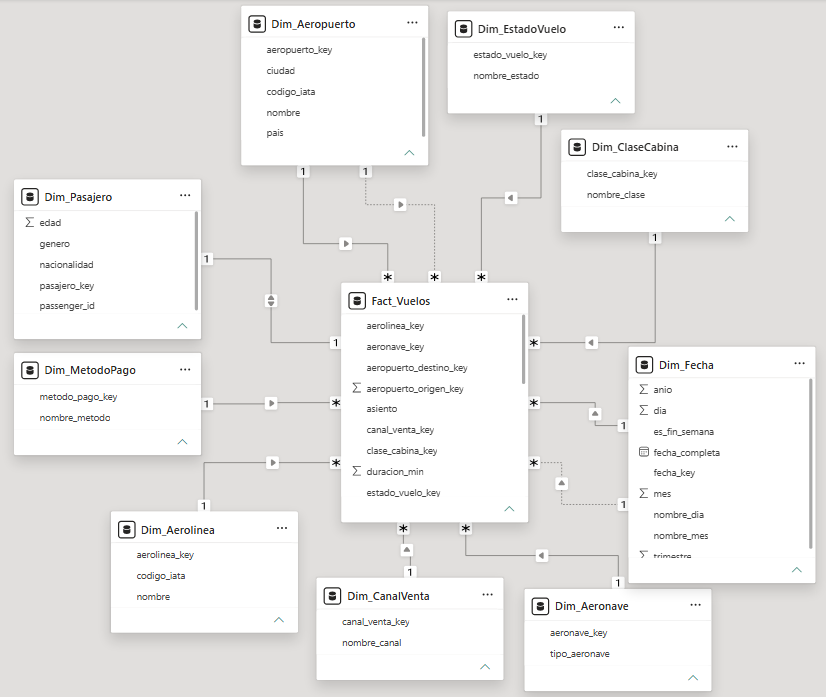

### 2.4 Jerarquías

Se construyeron dos jerarquías de navegación (drill-down) para facilitar el análisis a distintos
niveles de granularidad sin necesidad de crear visuales adicionales:

**Jerarquía "Fecha"** (sobre `Dim_Fecha`):
```
Año -> Trimestre -> Mes -> Fecha
```
Permite pasar de una vista anual a una mensual o diaria simplemente expandiendo el eje de
cualquier gráfico, sin cambiar de visual.

* jerarquía expandida (Fecha).
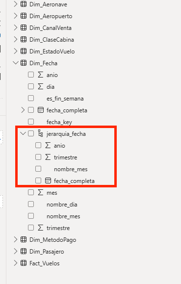

**Jerarquía "Aeropuerto"** (sobre `Dim_Aeropuerto`):
```
País -> Ciudad -> Aeropuerto
```
Permite analizar el negocio desde una perspectiva geográfica amplia (país) hasta el detalle de un
aeropuerto puntual, lo cual resulta especialmente relevante para el visual de mapa y para el
segmentador geográfico descritos más adelante.

* jerarquía expandida (Aeropuerto).
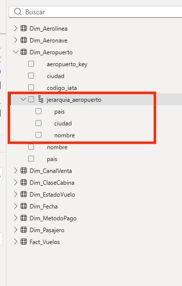

---

## 3. Medidas DAX implementadas

Todas las medidas se agruparon en una tabla de medidas dedicada (`_Medidas`), una práctica
recomendada en modelos tabulares profesionales que separa la lógica de cálculo de las tablas de
datos y facilita su mantenimiento y documentación.

### 3.1 Medidas base

| # | Medida | Fórmula DAX | Formato | Propósito de negocio |
|---|---|---|---|---|
| 1 | **Total Vuelos** | `COUNTROWS(Fact_Vuelos)` | Entero | Volumen total de vuelos/boletos vendidos; métrica de actividad base del negocio. |
| 2 | **Ingresos Totales USD** | `SUM(Fact_Vuelos[precio_ticket_usd])` | Moneda ($) | Ingreso total generado, ya estandarizado a USD para ser comparable entre monedas de origen. |
| 3 | **Retraso Promedio** | `CALCULATE(AVERAGE(Fact_Vuelos[retraso_min]), Fact_Vuelos[retraso_min] > 0)` | Número (1 decimal) | Mide la severidad promedio del retraso, calculado únicamente sobre vuelos que efectivamente se retrasaron (excluye los vuelos a tiempo, que distorsionarían el promedio hacia cero). |
| 4 | **Porcentaje Vuelos A Tiempo** | `DIVIDE(CALCULATE([Total Vuelos], Dim_EstadoVuelo[nombre_estado] = "ON_TIME"), [Total Vuelos])` | Porcentaje (1 decimal) | Indicador central de puntualidad y calidad de servicio; base del KPI con semáforo (sección 4). |
| 5 | **Meta Vuelos A Tiempo** | `0.90` | Porcentaje | Objetivo de negocio fijado en 90% de puntualidad, utilizado como umbral de comparación para el KPI. |

### 3.2 Medidas avanzadas

Estas medidas se agregaron para cubrir análisis de tendencia y crecimiento interanual, exigidos
como parte de las medidas DAX avanzadas de la práctica.

Un detalle relevante del modelo: `Dim_Fecha` **no es un calendario continuo día a día**, sino que
contiene únicamente las 861 fechas distintas que efectivamente aparecen en los datos (fechas de
salida y de reserva). Por esta razón, las medidas de comparación interanual **no utilizan las
funciones clásicas de time intelligence de DAX** (como `SAMEPERIODLASTYEAR` o `DATESYTD`), ya que
estas requieren un calendario contiguo marcado como tabla de fechas para funcionar correctamente.
En su lugar, se implementó una comparación interanual manual basada en la columna `anio` de
`Dim_Fecha`, la cual funciona de forma robusta independientemente de si el calendario tiene
huecos o no.

| # | Medida | Fórmula DAX | Propósito de negocio |
|---|---|---|---|
| 6 | **Ingresos Año Anterior** | ```VAR AnioActual = MAX(Dim_Fecha[anio])``` `RETURN CALCULATE([Ingresos Totales USD], FILTER(ALL(Dim_Fecha), Dim_Fecha[anio] = AnioActual - 1))` | Recalcula los ingresos totales pero fijando el año inmediatamente anterior al que está siendo visualizado, ignorando el filtro de año actual mediante `ALL()`. Es la base para calcular el crecimiento. |
| 7 | **Crecimiento Ingresos %** | `DIVIDE([Ingresos Totales USD] - [Ingresos Año Anterior], [Ingresos Año Anterior])` | Mide el porcentaje de crecimiento (o caída) de los ingresos respecto al año anterior; es el indicador de tendencia interanual (YoY) solicitado. |
| 8 | **Vuelos Año Anterior** | ```VAR AnioActual = MAX(Dim_Fecha[anio])``` `RETURN CALCULATE([Total Vuelos], FILTER(ALL(Dim_Fecha), Dim_Fecha[anio] = AnioActual - 1))` | Permite comparar no solo ingresos sino también volumen de operación año contra año, complementando el análisis de crecimiento. |


#### Tabla `_medidas` en Power BI para acceder de forma ordenada
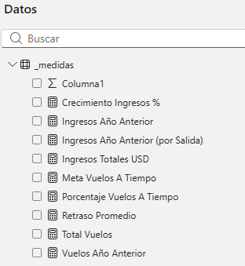

---

## 4. KPI con indicador visual (semáforo)

El indicador estratégico central del dashboard es el **porcentaje de vuelos a tiempo**, por ser la
métrica que más directamente refleja la calidad de servicio percibida por el cliente y el
cumplimiento operativo de las aerolíneas.

### 4.1 Implementación

Se utilizó un visual de **Tarjeta (Card)** con la medida `Porcentaje Vuelos A Tiempo`, sobre la
cual se configuró **formato condicional de tipo Íconos (Semáforo)**, con las siguientes reglas de
umbral:

| Rango de cumplimiento | Color / ícono | Interpretación de negocio |
|---|---|---|
| ≥ 90% (`Meta Vuelos A Tiempo`) | 🟢 Verde | La operación cumple el objetivo estratégico de puntualidad. |
| 75% – 89% | 🟡 Amarillo | Puntualidad aceptable, pero por debajo del objetivo; requiere seguimiento. |
| < 75% | 🔴 Rojo | Nivel de puntualidad crítico; requiere acción correctiva inmediata. |

De esta manera, el color del indicador cambia automáticamente cada vez que el usuario aplica un
filtro (por aerolínea, año, país, etc.), permitiendo detectar de un vistazo qué segmento del
negocio está incumpliendo el objetivo, sin necesidad de leer el número exacto.

#### Semaforo funcionando en el Dashboard

|verde|amarrillo|rojo|
|:-:|:-:|:-:|
|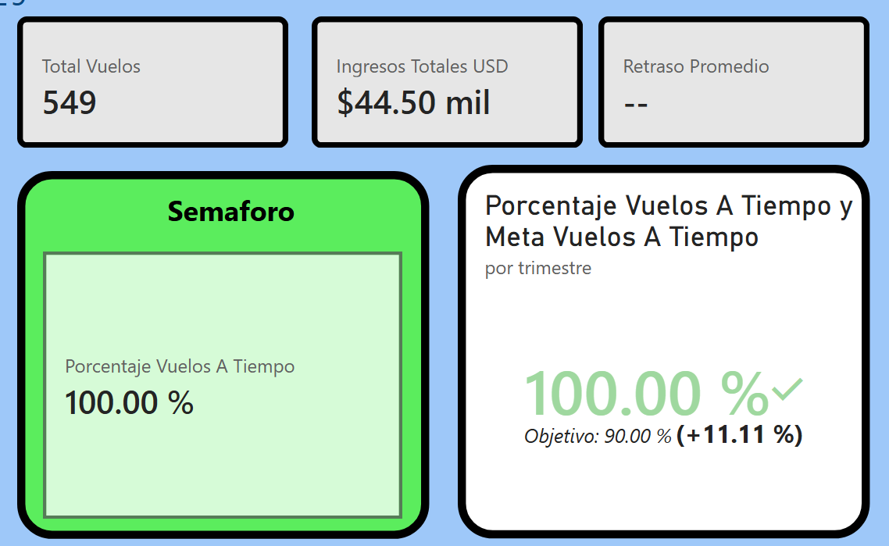|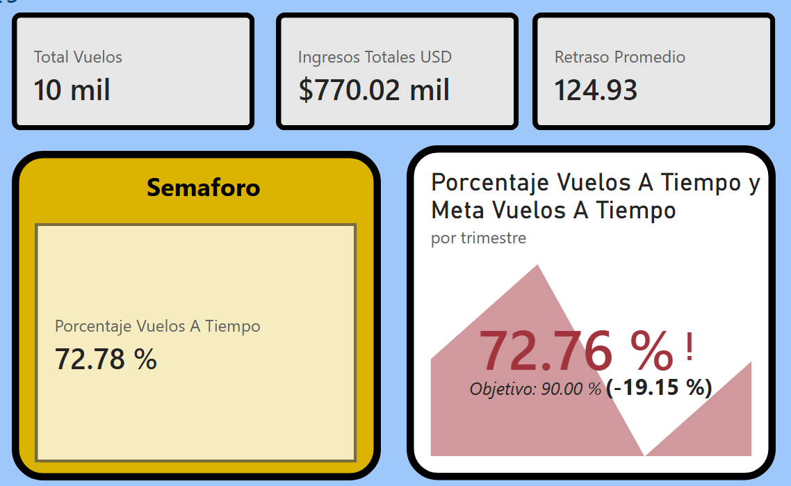|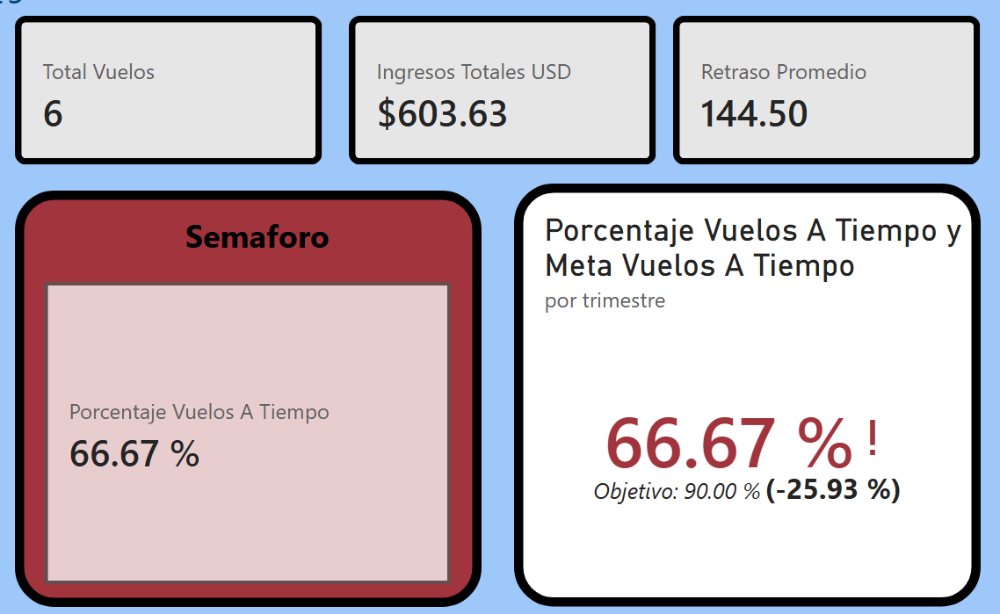|

### 4.2 Relevancia estratégica del KPI

La puntualidad es uno de los principales factores que impactan la satisfacción del cliente, la
reputación de una aerolínea y, en muchos mercados, está sujeta a regulación o penalización
contractual. Visualizar este KPI junto a un semáforo permite que un gerente, sin necesidad de
interpretar cifras estadísticas, identifique inmediatamente si la operación está dentro de los
parámetros aceptables, y combinado con los segmentadores del dashboard aislar rápidamente si el
problema de puntualidad se concentra en una aerolínea, un destino o un periodo específico.

---

## 5. Dashboard: visualizaciones y filtros interactivos

### 5.1 Tarjetas de resumen (KPIs de un vistazo)

En la franja superior del dashboard se colocaron cuatro tarjetas, cada una vinculada a una de las
medidas base, que ofrecen una lectura inmediata del estado general del negocio antes de entrar en
el detalle de los gráficos:

1. **Total Vuelos** : volumen total de operación.
2. **Ingresos Totales USD** : ingreso total generado.
3. **Retraso Promedio** : severidad promedio de los retrasos.
4. **Porcentaje Vuelos A Tiempo** : con el semáforo descrito en la sección 4.

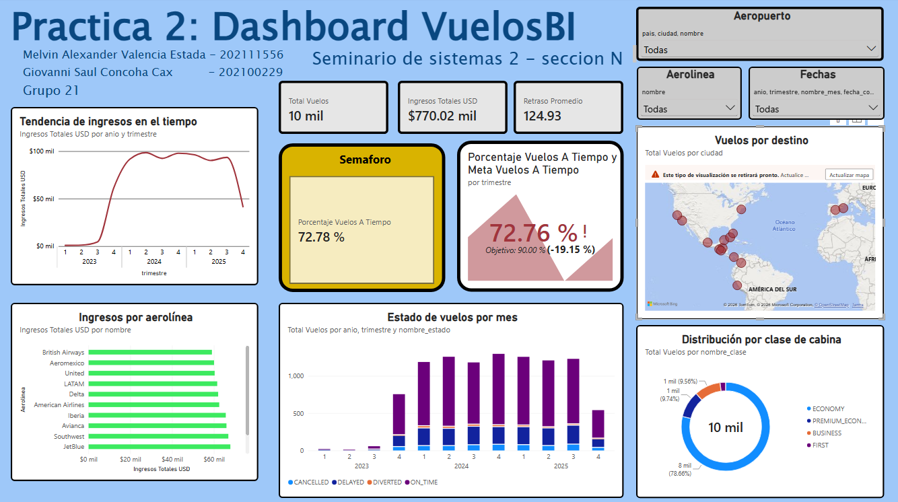

### 5.2 Visualizaciones

#### *Gráfico de líneas*

**Campos:**  
Eje: `Fecha` (jerarquía Año > Trimestre > Mes)  
Valores: `Ingresos Totales USD`

**¿Qué responde?**  
Permite analizar cómo evolucionan los ingresos a lo largo del tiempo, identificando tendencias de crecimiento o decrecimiento, patrones estacionales y variaciones entre períodos.

**Relevancia estratégica:**  
Facilita la detección de comportamientos recurrentes en la demanda y permite evaluar el impacto de decisiones comerciales, campañas, cambios operativos o eventos externos sobre los ingresos durante los dos años analizados.

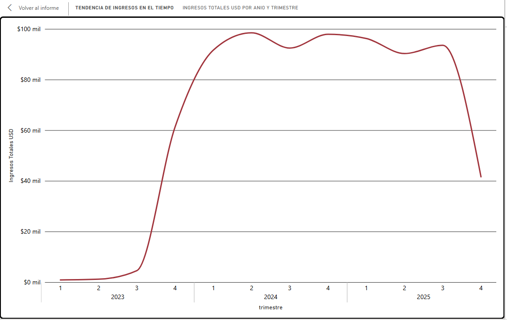

#### *Gráfico de barras horizontales*

**Campos:**  
Eje: `Dim_Aerolinea[nombre]`  
Valores: `Ingresos Totales USD` (ordenados de forma descendente)

**¿Qué responde?**  
Muestra cuáles son las aerolíneas que generan mayores ingresos y cómo se comparan entre sí en términos de contribución económica.

**Relevancia estratégica:**  
Apoya la identificación de socios comerciales clave, facilitando la priorización de negociaciones, alianzas estratégicas y acciones enfocadas en las aerolíneas con mayor rentabilidad para el negocio.

|Más de 50k|Menos de 50K|
|-|-|
|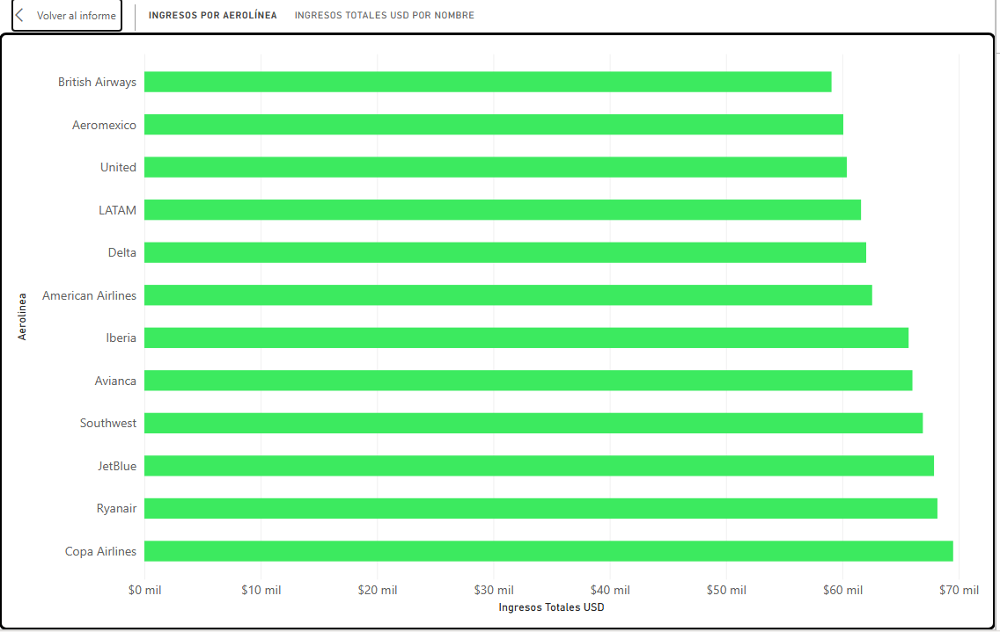|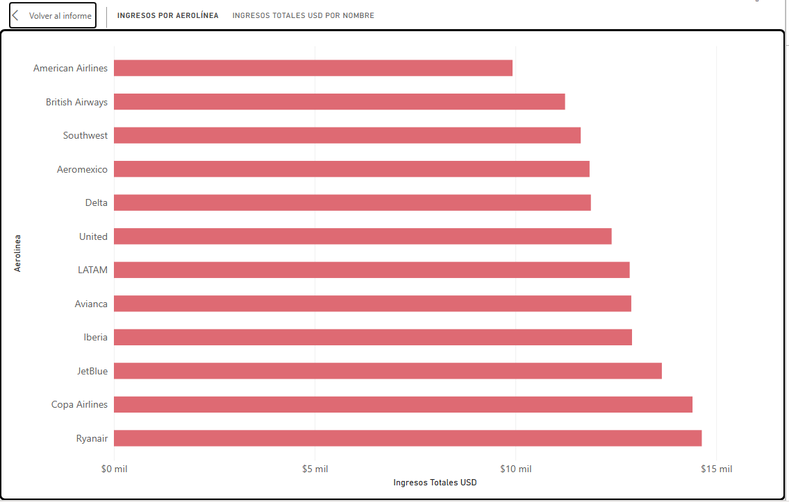|


#### *Mapa*

**Campos:**  
Ubicación: `Dim_Aeropuerto[ciudad]` (jerarquía Aeropuerto)  
Tamaño de burbuja: `Total Vuelos`

**¿Qué responde?**  
Permite visualizar la distribución geográfica del tráfico aéreo y detectar los destinos o aeropuertos con mayor concentración de vuelos.

**Relevancia estratégica:**  
Ayuda a identificar mercados de alta demanda y zonas con mayor actividad operativa, proporcionando información valiosa para decisiones relacionadas con expansión de rutas, inversión en infraestructura o fortalecimiento de operaciones en aeropuertos específicos.

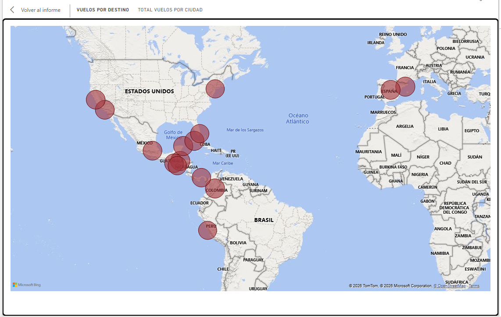

#### *Gráfico de anillo (Donut)*

**Campos:**  
Leyenda: `Dim_ClaseCabina[nombre_clase]`  
Valores: `Total Vuelos`

**¿Qué responde?**  
Permite visualizar cómo se distribuyen las ventas entre las diferentes clases de cabina, mostrando la participación que tiene cada categoría sobre el total de vuelos registrados. De esta manera, se puede identificar si la demanda se concentra en clases económicas o si existe una participación significativa de clases premium.

**Relevancia estratégica:**  
Informa sobre la mezcla de producto vendido (Economy, Premium Economy, Business, First Class, entre otras), proporcionando información clave para diseñar estrategias de pricing, segmentación de clientes y acciones de upselling orientadas a incrementar los ingresos mediante la migración de pasajeros hacia categorías de mayor valor.

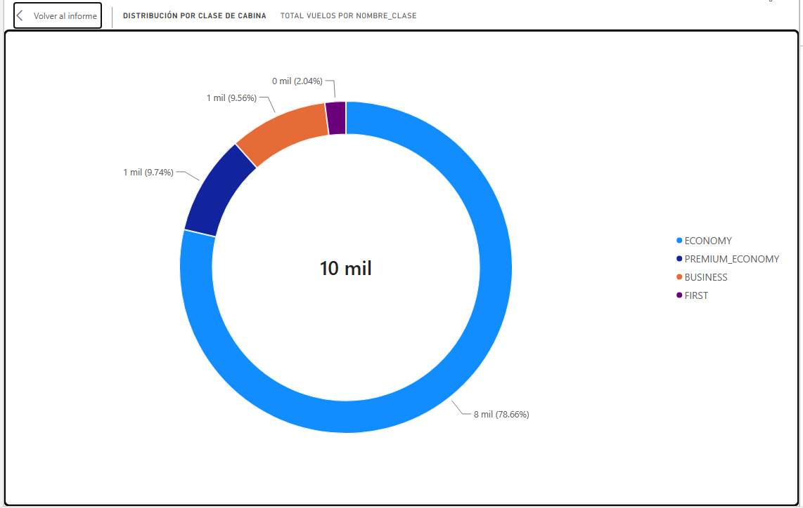


#### *Gráfico de columnas apiladas*

**Campos:**  
Eje: `Dim_Fecha[nombre_mes]`  
Leyenda: `Dim_EstadoVuelo[nombre_estado]`  
Valores: `Total Vuelos`

**¿Qué responde?**  
Permite analizar la distribución mensual de los vuelos según su estado operativo, diferenciando aquellos que llegaron a tiempo, los que presentaron retrasos y los que fueron cancelados. Esto facilita identificar variaciones en el desempeño operacional a lo largo del año.

**Relevancia estratégica:**  
Complementa directamente el KPI de puntualidad, ya que permite detectar si los retrasos o cancelaciones se concentran en determinados meses. Esta información resulta útil para identificar posibles patrones de estacionalidad operativa, evaluar riesgos de desempeño y definir acciones de mejora enfocadas en los períodos con mayores incidencias.

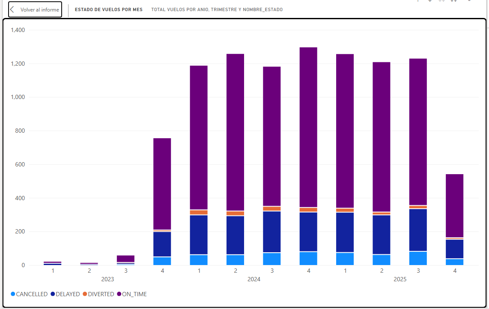

### 5.3 Segmentadores (filtros interactivos)

Se implementaron tres segmentadores que controlan de forma cruzada todas las tarjetas y
visualizaciones del dashboard:

| Segmentador | Campo | Estilo | Propósito |
|---|---|---|---|
| Aerolínea | `Dim_Aerolinea[nombre]` | Lista | Aislar el análisis a una o varias aerolíneas específicas. |
| Fecha | Jerarquía `Fecha` / `Dim_Fecha[anio]` | Lista / desplegable | Comparar el comportamiento del negocio entre 2024 y 2025, o acotarlo a un periodo puntual. |
| Geografía | Jerarquía `Aeropuerto` (`Dim_Aeropuerto[pais]` -> `ciudad` -> `nombre_aeropuerto`) | Lista con drill-down | Reemplaza al segmentador de clase de cabina propuesto inicialmente; permite filtrar el dashboard completo por país, ciudad o aeropuerto puntual, lo cual es más relevante dado que el visual de mapa (sección 5.2, visual #3) ya trabaja sobre esta misma dimensión geográfica y ambos elementos quedan coherentes entre sí. |

Gracias a que todas las relaciones del modelo (sección 2.3) filtran correctamente hacia
`Fact_Vuelos`, al seleccionar cualquier valor en estos segmentadores, **las 4 tarjetas, el
semáforo del KPI y las 5 visualizaciones se actualizan simultáneamente**, permitiendo un análisis
exploratorio real (por ejemplo: "¿cómo se ve la puntualidad de Avianca únicamente en Guatemala
durante 2025?") sin necesidad de crear un reporte distinto para cada pregunta de negocio.

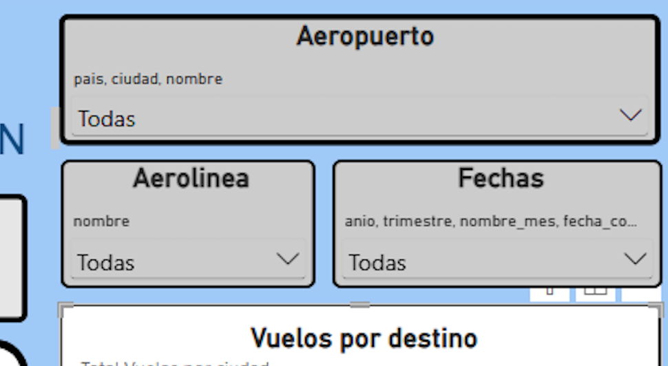

---

## 6. Relevancia estratégica del conjunto de la solución

La combinación de estos elementos responde directamente a las tres preguntas centrales de
cualquier operación de vuelos:

- **¿Cuánto estamos vendiendo y a qué ritmo crece?**  cubierto por `Total Vuelos`, `Ingresos
  Totales USD`, `Crecimiento Ingresos %` y el gráfico de tendencia mensual.
- **¿Estamos cumpliendo el nivel de servicio esperado?**  cubierto por `Porcentaje Vuelos A
  Tiempo`, su semáforo, `Retraso Promedio` y el gráfico de estado de vuelos por mes.
- **¿Dónde y con quién se concentra el negocio?**  cubierto por el mapa de destinos, el gráfico
  de ingresos por aerolínea, el gráfico de clase de cabina y los segmentadores geográfico y por
  aerolínea.

Al integrar estos tres ejes en un único dashboard interactivo, un tomador de decisiones puede
pasar de una vista general del negocio a una causa raíz específica (por ejemplo, una aerolínea
puntual con baja puntualidad en un país puntual) en pocos clics, sin necesidad de escribir
consultas SQL ni de solicitar reportes ad-hoc a un analista, que es precisamente el valor que un
entorno de inteligencia de negocios como Power BI aporta sobre el modelo dimensional construido en
la Fase 1.

---

## 7. Conclusiones

1. **Replicación fiel del modelo dimensional:**  
El modelo tabular implementado en Power BI reproduce con precisión el esquema en estrella de la base de datos VuelosBI, resolviendo de manera explícita el manejo de dimensiones de rol múltiple mediante relaciones inactivas activables con `USERELATIONSHIP()`. Esta consistencia garantiza la validez analítica y la coherencia con la fase previa del proyecto.

2. **Implementación robusta de medidas DAX y KPI estratégico:**  
Se desarrollaron ocho medidas DAX, cinco básicas y tres avanzadas, que permiten evaluar volumen, ingresos, puntualidad y crecimiento interanual. El KPI de puntualidad, acompañado de un indicador visual tipo semáforo, constituye un mecanismo claro y eficaz para monitorear el cumplimiento de objetivos operativos y estratégicos.

3. **Dashboard interactivo como herramienta de decisión:**  
El conjunto de tarjetas, visualizaciones y segmentadores integrados en el dashboard ofrece una visión integral del negocio, permitiendo pasar de un análisis general a la identificación de causas específicas en pocos clics. Este enfoque convierte la solución en un instrumento funcional de apoyo a la toma de decisiones estratégicas y operativas en la gestión de vuelos y aerolíneas.  
