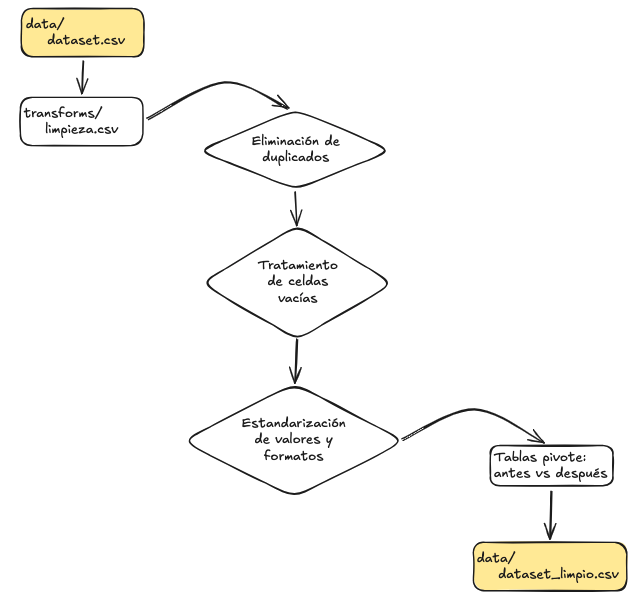
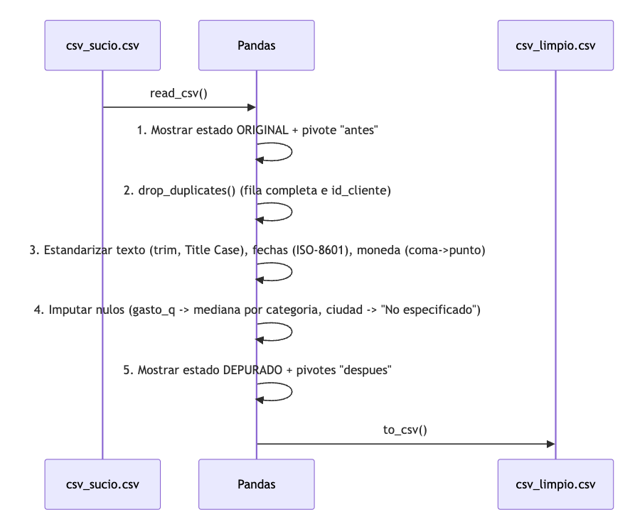
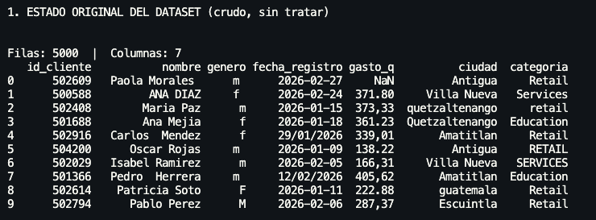
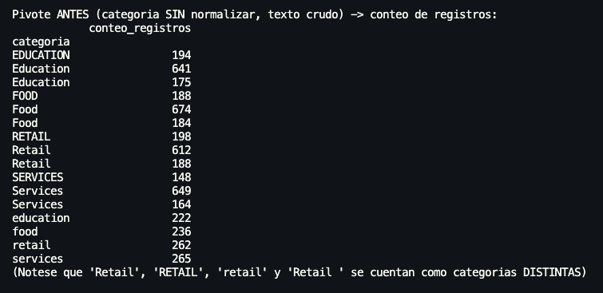
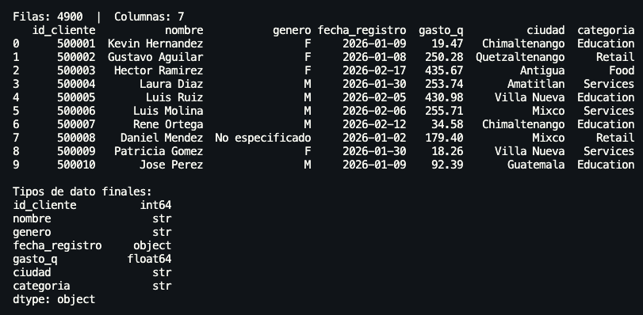
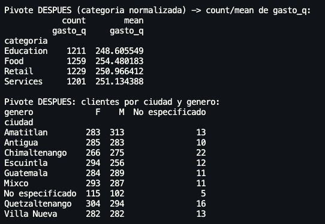

# Tarea 1 
# Limpieza y Estandarización de Datos

**Curso:** Seminario de sistemas 2 — Grupo 21

**Sección:** N

**Actividad:** Tarea 1 - Preparación, limpieza y exploración de datos con Pandas


| Nombres | Carné |
|---|---|
| Melvin Alexander Valencia Estrada | 202111556 |
| Giovanni Saul Concohá Cax | 202100229 |

---

## 1. Dataset utilizado

- **Nombre:** `csv_sucio.csv` — dataset de clientes (sintético, provisto para la tarea).
- **Registros originales:** 92 filas, 7 columnas.
- **Columnas:** `id_cliente`, `nombre`, `genero`, `fecha_registro`, `gasto_q`, `ciudad`, `categoria`.

Problemas de calidad detectados en el dataset crudo:

| Problema | Ejemplo en el CSV |
|---|---|
| Duplicados potenciales | Se valida por fila completa y por `id_cliente` |
| Celdas vacías | `gasto_q` (10), `genero` (3), `ciudad` (2) |
| Espacios extra en texto | `" Paola Morales "`, `"Carlos  Mendez"` |
| Mayúsculas/minúsculas inconsistentes | `RETAIL`, `retail`, `Retail` |
| Formato numérico mixto | `371.80` vs `"373,33"` (coma decimal) |
| Formato de fecha mixto | `2026-02-27` vs `29/01/2026` |
| Valor "nulo" disfrazado de texto | `ciudad = "NA"` |
| Filas en blanco | Líneas vacías intercaladas en el CSV |

---

## 2. Estructura del repositorio

```
Tarea1/
    ├── data/
    │   ├── csv_sucio.csv       # dataset original, sin tratar
    │   └── csv_limpio.csv      # dataset depurado
    ├── transforms/
    │   └── limpieza.py         # script de limpieza y estandarización
    └── README.md               # Documentación
```



---

## 3. Proceso de limpieza aplicado

El script `transforms/limpieza.py` ejecuta el flujo en este orden:



### 3.1 Eliminación de duplicados
- Se eliminan duplicados de **fila completa** (`drop_duplicates()`).
- Se eliminan duplicados por **llave de negocio** `id_cliente` (`keep="first"`).
- En esta corrida sobre `csv_sucio.csv`: **0 duplicados exactos** y **0 duplicados por `id_cliente`** — el dataset no traía registros repetidos, pero el script queda preparado para detectarlos y removerlos si aparecieran en una carga futura.

### 3.2 Tratamiento de celdas vacías
| Columna | Nulos detectados | Estrategia aplicada |
|---|---|---|
| `gasto_q` | 10 | Imputación con la **mediana de `gasto_q` por categoría** (más robusta que el promedio ante valores atípicos) |
| `genero` | 3 | Se marca explícitamente como `"No especificado"` (no se asume un género) |
| `ciudad` | 2 (+ valores `"NA"` como texto) | Se marca explícitamente como `"No especificado"` |
| `fecha_registro` | 0 tras normalizar | Fila se descartaría solo si la fecha fuera irrecuperable (no ocurrió en esta corrida) |

Tras el tratamiento, el dataset queda **con 0 celdas vacías** en todas las columnas.

### 3.3 Estandarización de valores y formatos
| Campo | Antes | Después |
|---|---|---|
| `nombre` | `" Paola Morales "`, `"Carlos  Mendez"` | `"Paola Morales"`, `"Carlos Mendez"` |
| `genero` | `m`, ` f `, `M`, `F`, vacío | `M`, `F`, `No especificado` |
| `fecha_registro` | `2026-02-27`, `29/01/2026` | `2026-02-27`, `2026-01-29` (ISO-8601) |
| `gasto_q` | `"373,33"`, `371.80` | `373.33`, `371.8` (float) |
| `ciudad` | `quetzaltenango`, `VILLA NUEVA`, `NA` | `Quetzaltenango`, `Villa Nueva`, `No especificado` |
| `categoria` | `RETAIL`, `retail `, `Retail` | `Retail` (categoría única) |

---

## 4. Tablas: estado original vs. estado depurado

> Nota: por instrucción del equipo, esta sección documenta los resultados con las **tablas reales generadas por el script** (salida de consola / dataframes) en lugar de capturas de pantalla.

### 4.1 Estado ORIGINAL — primeras filas (`df_original.head()`)

| id_cliente | nombre | genero | fecha_registro | gasto_q | ciudad | categoria |
|---|---|---|---|---|---|---|
| 502609 | ` Paola Morales ` | ` m ` | 2026-02-27 | *(vacío)* | Antigua | Retail |
| 500588 | ANA DIAZ | ` f ` | 2026-02-24 | 371.80 | Villa Nueva | Services |
| 502408 | Maria Paz | m | 2026-01-15 | "373,33" | quetzaltenango | retail |
| 502916 | Carlos  Mendez | f | 29/01/2026 | "339,01" | Amatitlan | Retail |
| 504200 | Oscar Rojas | ` m ` | 2026-01-09 | 138.22 | Antigua | RETAIL |



**Pivote ANTES** — conteo de registros por `categoria` *sin normalizar* (evidencia el problema de nomenclatura inconsistente):



`Retail`, `RETAIL` y `retail` se contaban como **3 categorías distintas** — el mismo problema ocurre con `Education`, `Food` y `Services`.

### 4.2 Estado DEPURADO — primeras filas (`df.head()`)



**Pivote DESPUÉS** — conteo y gasto promedio por `categoria` *(4 categorías únicas)*:

**Pivote DESPUÉS** — clientes por `ciudad` y `genero`:



---

## 5. Interpretación concisa de los resultados

- El dataset pasó de **92 filas crudas** a **92 filas limpias** (no había duplicados reales; el pipeline queda listo para eliminarlos si aparecen en corridas futuras).
- Antes de estandarizar, `categoria` tenía **12 variantes de texto** para solo **4 categorías reales** (`Retail`, `Services`, `Education`, `Food`); esto habría distorsionado cualquier análisis agregado (conteos, promedios) si no se corrige.
- `gasto_q` mezclaba **notación decimal centroamericana (coma) y anglosajona (punto)** — sin la conversión, un análisis numérico directo habría fallado o interpretado mal los valores tipo `"373,33"`.
- La imputación de `gasto_q` se hizo por **mediana dentro de cada categoría** (no con la media global) para no sesgar el gasto promedio de categorías con outliers.
- `fecha_registro` quedó **100% en formato ISO-8601**, eliminando la ambigüedad entre `DD/MM/YYYY` y `YYYY-MM-DD`.
- El dataset final **no tiene celdas vacías** y usa tipos de dato consistentes (`id_cliente`: entero, `fecha_registro`: fecha, `gasto_q`: decimal, resto: texto normalizado), por lo que **está listo para insertarse directamente en una tabla de un motor de base de datos** (por ejemplo, SQL Server / PostgreSQL) sin transformaciones adicionales.

---

## 6. Cómo ejecutar

```bash
cd Tarea1
python transforms/limpieza.py
```

El script imprime en consola el estado original, el proceso de limpieza paso a paso, las tablas pivote antes/después y la interpretación de resultados; además genera `data/csv_limpio.csv`.

