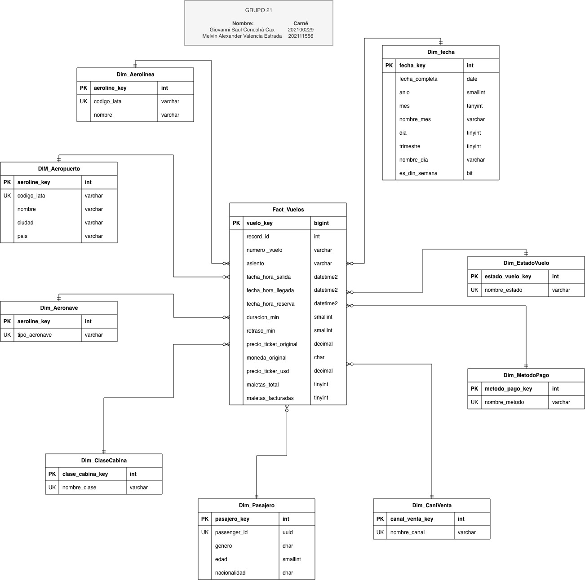

# Documentación Técnica — Base de Datos VuelosBI

## 1. Introducción

Este documento describe el diseño de la base de datos del proyecto **VuelosBI**, el modelo
dimensional implementado, y el procedimiento utilizado para desplegar Microsoft SQL Server 2022
mediante Docker, incluyendo la instalación de los componentes necesarios para que la aplicación
ETL en Python pueda conectarse al motor de base de datos.

Sirve como referencia técnica para la instalación, el mantenimiento y la resolución de problemas
del entorno de base de datos del proyecto.

## 2. Modelo dimensional

### 2.1 Tipo de esquema

Se implementó un esquema en **estrella (star schema)**: una tabla de hechos central
(`Fact_Vuelos`) rodeada de dimensiones desnormalizadas entre sí para lectura analítica rápida,
donde cada dimensión está internamente normalizada (sin atributos redundantes, una clave de
negocio única por fila).

Se eligió un esquema en estrella, en lugar de copo de nieve, porque es el estándar para cargas
analíticas de tipo OLAP: reduce la cantidad de combinaciones (`JOIN`) necesarias por consulta,
mejora el rendimiento de lectura, y es el modelo que las herramientas de inteligencia de negocios
(Power BI, Tableau) consumen de forma nativa.

`Dim_Aeropuerto` se referencia **dos veces** desde el hecho (origen y destino), y `Dim_Fecha`
también se referencia dos veces (fecha de salida y fecha de reserva). A esta técnica se le conoce
como *role-playing dimension*: una misma tabla física que cumple distintos roles lógicos dentro
del modelo, evitando duplicar la estructura de la dimensión.

### 2.2 Diagrama entidad-relación



### 2.3 Descripción de tablas

| Tabla | Rol | Grano / contenido |
|---|---|---|
| `Fact_Vuelos` | Hecho | Un registro por vuelo/boleto vendido |
| `Dim_Aerolinea` | Dimensión | Aerolínea (código IATA y nombre homologado) |
| `Dim_Aeropuerto` | Dimensión (doble rol) | Aeropuerto (código, ciudad, país); usada como origen y como destino |
| `Dim_Aeronave` | Dimensión | Tipo de aeronave |
| `Dim_ClaseCabina` | Dimensión | Economy, Premium Economy, Business |
| `Dim_Pasajero` | Dimensión | Pasajero deduplicado por `passenger_id` (género, edad, nacionalidad) |
| `Dim_CanalVenta` | Dimensión | Canal de venta (App, Web, Call Center, Aeropuerto, Agencia) |
| `Dim_MetodoPago` | Dimensión | Método de pago |
| `Dim_EstadoVuelo` | Dimensión | ON_TIME, DELAYED, CANCELLED |
| `Dim_Fecha` | Dimensión (doble rol) | Calendario; usada como fecha de salida y fecha de reserva |

### 2.4 Justificación de diseño

| Decisión | Razón |
|---|---|
| Esquema en estrella (no copo de nieve) | Menos combinaciones por consulta analítica, mejor rendimiento de lectura, estándar consumido por herramientas de BI. |
| `Dim_Aeropuerto` con doble rol (origen/destino) | Evita crear dos tablas idénticas; una sola tabla física, dos claves foráneas distintas en el hecho. |
| `Dim_Fecha` con doble rol (salida/reserva) | Permite analizar tanto la fecha del vuelo como la anticipación de compra sin duplicar la dimensión. |
| `Dim_Pasajero` con clave de negocio `passenger_id` | El CSV trae un identificador único (UUID) de pasajero; se deduplica para no contar dos veces al mismo pasajero en distintos vuelos. |
| `numero_vuelo` y `asiento` como dimensiones degeneradas | Son atributos de grano fino, prácticamente únicos por transacción, que no ameritan una tabla propia. |
| `precio_ticket_original` + `moneda_original` + `precio_ticket_usd` | Se conserva el dato crudo (auditoría) junto con el estandarizado (comparabilidad entre monedas). |
| Restricciones `UNIQUE` en cada clave de negocio de dimensión | Evita duplicados cuando el proceso ETL se ejecuta más de una vez (carga incremental / idempotencia). |
| `UNIQUE (record_id)` en el hecho | Garantiza que reprocesar el mismo archivo fuente no duplique vuelos ya cargados. |

### 2.5 Integridad referencial

Todas las claves foráneas del hecho están declaradas con `REFERENCES` hacia su dimensión
correspondiente. Cada clave de negocio de dimensión tiene una restricción `UNIQUE`, y
`Fact_Vuelos.record_id` también es `UNIQUE`. Adicionalmente, `Dim_Pasajero` incluye restricciones
`CHECK` sobre `genero` (solo admite `M`, `F`, `X`) y sobre `edad` (rango entre 0 y 120).

Se crearon índices sobre las claves foráneas más consultadas (`aerolinea_key`,
`aeropuerto_destino_key`, `aeropuerto_origen_key`, `fecha_salida_key`, `pasajero_key`,
`estado_vuelo_key`) para optimizar el rendimiento de las consultas analíticas.

### 2.6 Script de creación

El script `BaseDatos/database.sql` es idempotente: al inicio elimina (`DROP TABLE`) cada tabla si
ya existe, antes de recrearla, por lo que puede ejecutarse repetidamente sin generar errores. Al
final del script se insertan valores de referencia iniciales para las dimensiones de bajo volumen
(`Dim_EstadoVuelo`, `Dim_ClaseCabina`, `Dim_CanalVenta`, `Dim_MetodoPago`); estos `INSERT` no son
obligatorios, ya que el proceso ETL inserta y actualiza estas dimensiones automáticamente
mediante el patrón *get-or-create*, pero se dejan como referencia y para pruebas manuales del
modelo.

## 3. Despliegue de SQL Server mediante Docker

### 3.1 Arquitectura de la solución

| Componente | Descripción |
|---|---|
| Docker | Plataforma de contenedores utilizada para ejecutar SQL Server aislado del sistema operativo anfitrión. |
| SQL Server 2022 | Motor de base de datos relacional utilizado para almacenar el Data Warehouse. |
| Docker Compose | Herramienta utilizada para orquestar el despliegue del contenedor. |
| SQLAlchemy | Capa de conexión utilizada por el ETL. |
| PyODBC | Driver de acceso entre Python y SQL Server. |
| ODBC Driver 18 for SQL Server | Driver oficial de Microsoft para Linux requerido por PyODBC. |
| unixODBC | Administrador de drivers ODBC utilizado por Linux. |

### 3.2 Imagen base

Se utilizó la imagen oficial de Microsoft SQL Server 2022:

```dockerfile
FROM mcr.microsoft.com/mssql/server:2022-latest
```

Esta imagen proporciona una instalación completamente funcional de SQL Server dentro de un
contenedor Linux.

### 3.3 Dockerfile

Ubicación: `BaseDatos/Dockerfile`

```dockerfile
FROM mcr.microsoft.com/mssql/server:2022-latest

ENV ACCEPT_EULA=${ACCEPT_EULA}
ENV MSSQL_SA_PASSWORD=${MSSQL_SA_PASSWORD}
ENV MSSQL_PID=${MSSQL_PID}

USER root

COPY database.sql /init.sql
COPY entrypoint.sh /entrypoint.sh

RUN chmod +x /entrypoint.sh

ENTRYPOINT ["/entrypoint.sh"]
```

**Descripción de cada instrucción:**

- `FROM mcr.microsoft.com/mssql/server:2022-latest`: descarga la imagen oficial de SQL Server 2022.
- `ENV ACCEPT_EULA / MSSQL_SA_PASSWORD / MSSQL_PID`: permiten que SQL Server se configure utilizando los valores definidos en el archivo `.env`.
- `USER root`: necesario para copiar archivos y establecer permisos durante la construcción de la imagen.
- `COPY database.sql /init.sql`: transfiere el script de creación del esquema de base de datos al contenedor.
- `COPY entrypoint.sh /entrypoint.sh`: transfiere el script que ejecutará automáticamente el script SQL al iniciar el contenedor.
- `RUN chmod +x /entrypoint.sh`: otorga permisos de ejecución al script de inicialización.
- `ENTRYPOINT ["/entrypoint.sh"]`: indica que el contenedor ejecutará automáticamente este script al iniciar.

### 3.4 Script de inicialización

Ubicación: `BaseDatos/entrypoint.sh`

```bash
#!/bin/bash

/opt/mssql/bin/sqlservr &

echo "Esperando a SQL Server..."

sleep 30

/opt/mssql-tools18/bin/sqlcmd \
-S localhost \
-U sa \
-P "$MSSQL_SA_PASSWORD" \
-C \
-i /init.sql

wait
```

**Funcionamiento:**

- `/opt/mssql/bin/sqlservr &`: lanza el motor SQL Server en segundo plano.
- `sleep 30`: SQL Server requiere algunos segundos para quedar disponible para conexiones antes de poder ejecutar comandos contra él.
- `sqlcmd -i /init.sql`: ejecuta automáticamente el script de creación del Data Warehouse.
- `-C`: indica a `sqlcmd` que confíe en certificados autofirmados, necesario porque SQL Server dentro del contenedor utiliza por defecto un certificado SSL autofirmado.
- `wait`: mantiene el proceso del contenedor activo, a la espera del proceso de SQL Server en segundo plano.

### 3.5 Orquestación mediante Docker Compose

```yaml
services:
  mssql:
    build:
      context: ./BaseDatos
      dockerfile: Dockerfile

    container_name: mssql-practica1

    restart: always

    env_file:
      - ./.env

    ports:
      - "1433:1433"

    volumes:
      - mssql_data:/var/opt/mssql

volumes:
  mssql_data:
```

**Beneficios de esta configuración:**

- **Persistencia** (`mssql_data:/var/opt/mssql`): los datos permanecen almacenados aunque el contenedor sea eliminado y recreado.
- **Variables centralizadas** (`env_file: ./.env`): permite mantener las credenciales fuera del código fuente.
- **Publicación del puerto** (`1433:1433`): expone SQL Server al sistema anfitrión para permitir conexiones desde la aplicación ETL.

### 3.6 Variables de entorno

```env
ACCEPT_EULA=Y
MSSQL_SA_PASSWORD=********
MSSQL_PID=Developer

DB_SERVER=localhost
DB_NAME=VuelosBI
DB_USER=sa
DB_PASSWORD=********
DB_DRIVER=ODBC Driver 18 for SQL Server
DB_TRUSTED_CONNECTION=false
```

| Variable | Descripción |
|---|---|
| `DB_SERVER` | Servidor SQL (`localhost`, ya que el contenedor publica el puerto 1433 al anfitrión). |
| `DB_NAME` | Base de datos del proyecto (`VuelosBI`). |
| `DB_USER` | Usuario administrador (`sa`). |
| `DB_PASSWORD` | Contraseña del usuario administrador. |
| `DB_DRIVER` | Driver ODBC utilizado por PyODBC (`ODBC Driver 18 for SQL Server`). |
| `DB_TRUSTED_CONNECTION` | Determina si se utiliza autenticación integrada. En Linux se utiliza autenticación basada en usuario y contraseña, por lo que se deja en `false`. |

## 4. Instalación de componentes ODBC en Ubuntu

Para permitir que Python se conecte a SQL Server desde el sistema anfitrión (o desde cualquier
entorno Linux donde corra la aplicación ETL), es necesario instalar los siguientes componentes.

### 4.1 unixODBC

Administrador de drivers ODBC para Linux.

Verificación:

```bash
odbcinst -j
```

Resultado esperado:

```text
unixODBC 2.3.12
```

### 4.2 Biblioteca libodbc

Verificación:

```bash
find /usr -name "libodbc.so*"
```

Resultado esperado:

```text
/usr/lib/x86_64-linux-gnu/libodbc.so.2
/usr/lib/x86_64-linux-gnu/libodbc.so.2.0.0
```

Esta biblioteca es utilizada por PyODBC para interactuar con SQL Server.

### 4.3 Microsoft ODBC Driver 18

Verificación:

```bash
odbcinst -q -d
```

Resultado esperado:

```text
[ODBC Driver 18 for SQL Server]
```

Este driver traduce las llamadas ODBC hacia el protocolo de comunicación de SQL Server.

## 5. Problemas encontrados y resolución

| # | Problema | Causa | Solución |
|---|---|---|---|
| 1 | `ImportError: libodbc.so.2` | unixODBC no estaba instalado en el sistema. | Instalar los paquetes `unixodbc`, `libodbc` y `odbcinst`. |
| 2 | `Can't open lib 'ODBC Driver 17 for SQL Server'` | No estaba instalado el driver de Microsoft correspondiente. | Instalar `ODBC Driver 18 for SQL Server` y actualizar `DB_DRIVER` en la configuración del proyecto para utilizar dicha versión. |
| 3 | `os.getenv("DB_DRIVER")` retornaba `None` | El archivo `.env` no se estaba cargando automáticamente. | Agregar `from dotenv import load_dotenv` y `load_dotenv(BASE_DIR / ".env")` en `config.py`. |
| 4 | `certificate verify failed: self-signed certificate` | SQL Server dentro de Docker utiliza un certificado SSL autofirmado por defecto. | Agregar `TrustServerCertificate=yes;` a la cadena de conexión ODBC. |

## 6. Verificación de la instalación

**Verificar que el contenedor está activo:**

```bash
docker ps
```

**Acceder al contenedor:**

```bash
docker exec -it mssql-practica1 bash
```

**Abrir cliente SQL dentro del contenedor:**

```bash
/opt/mssql-tools18/bin/sqlcmd \
-S localhost \
-U sa \
-P "PASSWORD" \
-C
```

**Verificar bases de datos:**

```sql
SELECT name
FROM sys.databases;
GO
```

Resultado esperado:

```text
master
model
msdb
tempdb
VuelosBI
```

**Verificar tablas:**

```sql
USE VuelosBI;
GO

SELECT TABLE_NAME
FROM INFORMATION_SCHEMA.TABLES;
GO
```

Resultado esperado:

```text
Dim_Aerolinea
Dim_Aeropuerto
Dim_Aeronave
Dim_ClaseCabina
Dim_CanalVenta
Dim_MetodoPago
Dim_EstadoVuelo
Dim_Pasajero
Dim_Fecha
Fact_Vuelos
```

## 7. Estado final de la plataforma

Al finalizar la configuración se obtuvo un entorno funcional compuesto por:

- SQL Server 2022 ejecutándose en un contenedor Docker.
- Base de datos VuelosBI, con su modelo dimensional en estrella, creada automáticamente al
  iniciar el contenedor.
- Persistencia de datos mediante volúmenes de Docker.
- Driver ODBC 18 for SQL Server instalado y registrado en Ubuntu.
- PyODBC y SQLAlchemy comunicándose correctamente con SQL Server.
- Carga automática del esquema físico mediante `database.sql`.
- Configuración centralizada mediante variables de entorno (`.env`).
- Entorno listo para la ejecución del proceso ETL del proyecto, descrito en el documento
  de documentación del ETL.