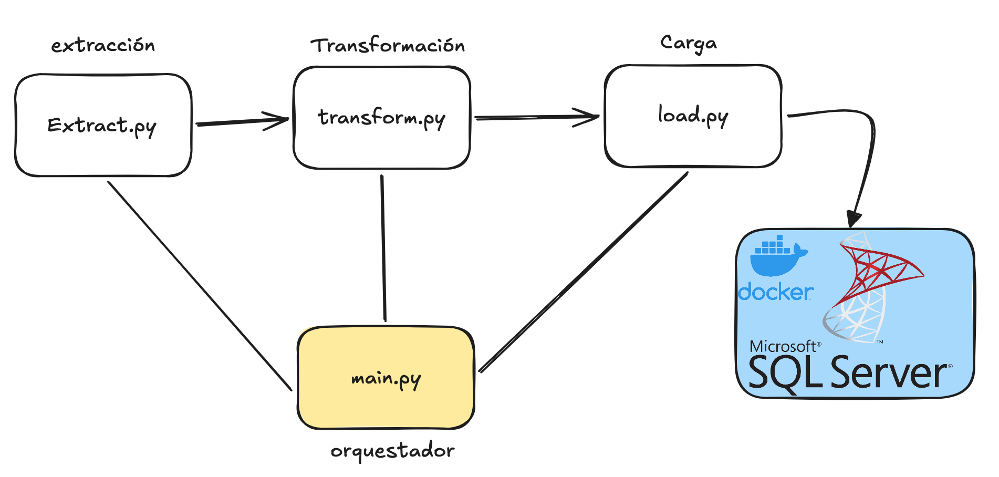

# Documentación Técnica — Proceso ETL VuelosBI

## 1. Introducción

Este documento describe la aplicación ETL (Extracción, Transformación y Carga) desarrollada en
Python para el proyecto VuelosBI. La aplicación toma como fuente un archivo CSV con registros de
vuelos, estandariza y homologa la información, y la carga en el modelo dimensional en estrella
implementado en SQL Server (ver documento de documentación de base de datos).

## 2. Arquitectura general

El proceso está organizado en tres fases independientes, orquestadas por un módulo principal,
siguiendo el patrón estándar de un pipeline ETL:



| Archivo | Fase | Responsabilidad |
|---|---|---|
| `config.py` | Configuración | Rutas del proyecto, cadena de conexión a SQL Server, catálogos de referencia. |
| `logger.py` | Soporte | Logging centralizado (consola y archivo). |
| `extract.py` | Fase 1 | Lectura y validación estructural del/los archivo(s) fuente. |
| `transform.py` | Fase 2 | Limpieza, homologación y construcción de las tablas del modelo dimensional. |
| `load.py` | Fase 3 | Carga incremental de dimensiones y hechos en SQL Server. |
| `main.py` | Orquestación | Ejecuta las tres fases en orden, con manejo de errores y logging de principio a fin. |

## 3. Dependencias

Definidas en `requirements.txt`:

| Librería | Uso |
|---|---|
| `pandas` | Manipulación y limpieza de datos tabulares. |
| `numpy` | Soporte numérico utilizado por pandas. |
| `SQLAlchemy` | Capa de conexión y ejecución de sentencias SQL contra el motor de base de datos. |
| `pyodbc` | Driver de bajo nivel para la comunicación con SQL Server vía ODBC. |
| `python-dotenv` | Carga de variables de entorno desde el archivo `.env`. |

## 4. Configuración (`config.py`)

Centraliza toda la configuración del proyecto:

- **Rutas**: define `DATA_DIR` (carpeta donde se colocan los archivos CSV fuente) y `LOG_DIR`
  (carpeta donde se escriben los archivos de log de cada corrida).
- **Variables de entorno**: mediante `python-dotenv`, carga el archivo `.env` ubicado en la raíz
  del proyecto, de donde obtiene el servidor, la base de datos, el usuario, la contraseña y el
  driver ODBC a utilizar. Las credenciales nunca se codifican directamente en el código fuente.
- **Cadena de conexión**: la función `get_connection_string()` construye la cadena de conexión
  ODBC para SQLAlchemy, incluyendo `TrustServerCertificate=yes`, necesario porque la instancia de
  SQL Server en Docker utiliza un certificado SSL autofirmado (ver documento de base de datos,
  sección de problemas encontrados).
- **Catálogos de referencia**: `AIRPORT_CATALOG` (nombre, ciudad y país por código IATA de
  aeropuerto) y `AIRLINE_CATALOG` (nombre canónico por código IATA de aerolínea), utilizados en
  la fase de transformación para enriquecer y homologar los datos.

## 5. Registro de eventos (`logger.py`)

Provee una función `get_logger(name)` que configura un logger con dos salidas simultáneas:

- **Consola**: nivel `INFO`, para seguimiento en tiempo real de la ejecución.
- **Archivo**: nivel `DEBUG`, un archivo distinto por cada corrida (`logs/etl_<timestamp>.log`),
  para trazabilidad completa y auditoría posterior.

Todos los módulos del proyecto (`extract`, `transform`, `load`, `main`) utilizan este logger
centralizado, de modo que una sola corrida del proceso genera un registro consolidado y
cronológico de las tres fases.

## 6. Fase 1 — Extracción (`extract.py`)

**Responsabilidad:** obtener los datos crudos desde el/los archivo(s) fuente, sin aplicar
ninguna transformación, y garantizar que el esquema del archivo sea el esperado antes de
continuar con el resto del proceso.

**Funcionamiento:**

1. Busca todos los archivos `.csv` dentro de `data/` (soporta múltiples archivos fuente, que se
   concatenan en un único DataFrame).
2. Por cada archivo encontrado, valida que contenga las 26 columnas esperadas
   (`EXPECTED_COLUMNS`); si falta alguna, la extracción se detiene con un error explícito
   (`ExtractionError`) antes de intentar transformar datos incompletos.
3. Concatena todos los archivos leídos en un único DataFrame.
4. Elimina duplicados exactos por `record_id`, registrando en el log cuántas filas se eliminaron
   por esta causa.
5. Registra en el log la cantidad de archivos encontrados y el total de filas extraídas.

**Manejo de errores:** cualquier fallo de lectura o de validación de columnas se propaga como
`ExtractionError`, una excepción específica de esta fase que `main.py` captura de forma
diferenciada.

## 7. Fase 2 — Transformación (`transform.py`)

**Responsabilidad:** limpiar, homologar y estandarizar los datos crudos, y construir en memoria
un DataFrame por cada tabla del modelo dimensional (nueve dimensiones y el hecho), con la forma
exacta que espera `database.sql`.

### 7.1 Problemas de calidad de datos y su tratamiento

| Problema detectado en el CSV fuente | Ejemplo | Tratamiento aplicado |
|---|---|---|
| Fechas en dos formatos distintos dentro de la misma columna | `20/01/2024 10:14` (DD/MM/AAAA, 24 horas) frente a `03-15-2025 01:58 PM` (MM-DD-AAAA, 12 horas AM/PM) | Se distinguen por el separador y la presencia de `AM`/`PM`, y se parsean con la máscara correspondiente. Formatos adicionales se intentan como respaldo antes de descartar la fecha. |
| Códigos de aeropuerto en minúscula | `jfk`, `cun` | Normalización a mayúscula. |
| Nombre de aerolínea inconsistente para el mismo código IATA | `Ryanair` / `RYANAIR`, `American Airlines` / `AMERICAN AIRLINES` | Homologación por código IATA contra `config.AIRLINE_CATALOG` (el código es la fuente de verdad, no el texto libre). |
| Género del pasajero con múltiples representaciones | `M` / `F` / `X` / `m` / `f` / `Masculino` / `Femenino` | Normalización a `M`, `F` o `X`. Cualquier valor no reconocido se homologa a `X`. |
| Precio del ticket con separador decimal de coma | `"77,60"` | Se detecta coma sin punto en el valor y se convierte a notación con punto antes de castear a numérico. |
| Campos categóricos vacíos (por ejemplo, `sales_channel` sin valor) | `...,03/07/2025 08:02,,TARJETA,...` | Se homologan al valor explícito `SIN_DATO`, en lugar de descartar el vuelo completo. Esto evita perder registros válidos en la tabla de hechos por la ausencia de un solo atributo categórico. |
| Valores nulos legítimos en vuelos `CANCELLED` | `arrival_datetime`, `duration_min`, `delay_min` vacíos | Se conservan como `NULL`; no se inventan valores para una ausencia real del negocio. |
| Inconsistencia lógica: llegada anterior a la salida | `arrival_datetime < departure_datetime` tras el parseo | Se detecta, se registra como advertencia en el log, y se anula únicamente el campo de llegada (el vuelo no se descarta). |
| Número de vuelo en minúscula | `aa0848` | Normalización a mayúscula. |
| Filas sin `record_id` o con precio no parseable | — | Se descartan y se contabilizan en el log, para mantener trazabilidad de cuántas filas se excluyeron y por qué. |

### 7.2 Construcción de las tablas del modelo

Tras la limpieza, `transform()` construye y devuelve un diccionario con nueve DataFrames de
dimensión y uno de hecho:

- **Dimensiones deduplicadas por su clave de negocio**: `dim_aerolinea` (por `codigo_iata`),
  `dim_aeropuerto` (por `codigo_iata`, combinando orígenes y destinos, enriquecida con
  `AIRPORT_CATALOG`), `dim_aeronave`, `dim_clase_cabina`, `dim_canal_venta`, `dim_metodo_pago`,
  `dim_estado_vuelo` (por su valor categórico), y `dim_pasajero` (por `passenger_id`, para no
  contar dos veces al mismo pasajero en distintos vuelos).
- **`dim_fecha`**: se construye a partir de la unión de todas las fechas de salida y de reserva
  presentes en los datos, generando los atributos de calendario (año, mes, nombre de mes, día,
  trimestre, nombre de día, indicador de fin de semana) y una clave `fecha_key` en formato
  `YYYYMMDD`.
- **`fact_vuelos`**: conserva las claves de negocio necesarias (código de aerolínea, aeropuertos,
  tipo de aeronave, clase de cabina, `passenger_id`, canal de venta, método de pago, estado) para
  que `load.py` resuelva las claves foráneas (`surrogate keys`) al momento de la carga, junto con
  las métricas del hecho (duración, retraso, precios, maletas) y las marcas de tiempo completas.

## 8. Fase 3 — Carga (`load.py`)

**Responsabilidad:** insertar las dimensiones y el hecho en SQL Server, resolviendo las claves
foráneas reales (`surrogate keys`) a partir de las claves de negocio construidas en la fase de
transformación.

### 8.1 Patrón *get-or-create* para las dimensiones

La función `_get_or_create_dim()` implementa, para cada dimensión, el siguiente procedimiento:

1. Consulta en SQL Server los valores ya existentes de la clave de negocio de la dimensión
   (`unique_cols`), convirtiéndolos explícitamente a texto **del lado del servidor** mediante
   `CAST(... AS NVARCHAR(200))`. Esto evita inconsistencias derivadas de cómo el driver ODBC
   representa ciertos tipos de dato en Python (por ejemplo, columnas `UNIQUEIDENTIFIER`, que
   según el driver pueden llegar como texto, como objeto UUID o como bytes sin decodificar).
2. Compara los valores nuevos contra los existentes utilizando únicamente la clave de negocio
   real (no el resto de los atributos), determinando así qué filas son efectivamente nuevas.
3. Inserta solo las filas nuevas.
4. Vuelve a consultar la tabla para obtener la `surrogate key` de cada fila, tanto la de las
   filas recién insertadas como la de las que ya existían, y la agrega al DataFrame original.

Este mecanismo hace que el proceso sea **idempotente** a nivel de dimensiones: ejecutar el ETL
varias veces contra el mismo archivo fuente no genera duplicados.

### 8.2 Resolución de claves foráneas en el hecho

Una vez resueltas las nueve dimensiones, se realiza una serie de combinaciones (`merge`) entre
`fact_vuelos` y cada dimensión, reemplazando cada clave de negocio por su `surrogate key`
correspondiente (`aerolinea_key`, `aeropuerto_origen_key`, `aeropuerto_destino_key`,
`aeronave_key`, `clase_cabina_key`, `pasajero_key`, `canal_venta_key`, `metodo_pago_key`,
`estado_vuelo_key`). Nótese que `Dim_Aeropuerto` se combina dos veces (una para origen y otra
para destino), y de igual forma `Dim_Fecha` se referencia dos veces mediante las columnas
`fecha_salida_key` y `fecha_reserva_key`, calculadas directamente en la fase de transformación.

### 8.3 Validación de integridad antes de la carga

Toda fila del hecho a la que le falte alguna clave foránea (es decir, cuya clave de negocio no
haya encontrado coincidencia en su dimensión) se excluye de la carga y se reporta en el log,
identificando los `record_id` afectados. Esta validación evita que se inserten filas que violen
la integridad referencial definida en `database.sql`.

### 8.4 Carga incremental del hecho

Antes de insertar, se consultan los `record_id` ya presentes en `Fact_Vuelos` y se excluyen del
lote a insertar. De esta manera, ejecutar el ETL repetidamente sobre el mismo archivo fuente (o
sobre un archivo que contenga registros ya cargados) no genera duplicados ni produce errores de
restricción `UNIQUE`.

## 9. Orquestación (`main.py`)

`run_etl()` ejecuta las tres fases en orden estricto (extracción, transformación, carga),
capturando las excepciones específicas de cada fase (`ExtractionError`, `LoadError`) y cualquier
excepción no anticipada, de forma que:

- Si la extracción falla, el proceso se detiene sin intentar transformar datos incompletos.
- Si la carga falla, el punto exacto de la falla queda registrado en el log junto con la
  traza completa del error.
- El tiempo total de ejecución se mide y se reporta al finalizar.

El script retorna el código de salida `0` en caso de éxito y `1` en caso de error, lo que permite
integrarlo en flujos de automatización o scripts de verificación.

**Ejecución:**

```bash
cd Transformacion
python main.py
```

## 10. Ejecución de referencia

A continuación se muestra la salida de una corrida completa y exitosa del proceso, ejecutada
contra el archivo de 10,000 registros:

```
2026-08-20 19:20:29 | INFO     | main    | INICIO DEL PROCESO ETL - VuelosBI
2026-08-20 19:20:29 | INFO     | main    | [1/3] Extraccion...
2026-08-20 19:20:29 | INFO     | extract | Archivos fuente encontrados: [...vuelos_sample.csv]
2026-08-20 19:20:29 | INFO     | extract |   -> vuelos_sample.csv: 10000 filas leidas
2026-08-20 19:20:29 | INFO     | extract | Extraccion completa: 10000 registros crudos en total
2026-08-20 19:20:29 | INFO     | main    | [2/3] Transformacion...
2026-08-20 19:20:29 | INFO     | transform | Iniciando transformacion de 10000 registros
2026-08-20 19:20:30 | WARNING  | transform | 620 vuelos con arrival_datetime anterior a
                                              departure_datetime; se anula la llegada
2026-08-20 19:20:30 | WARNING  | transform | 144 filas con 'sales_channel' vacio se
                                              homologan a 'SIN_DATO'
2026-08-20 19:20:30 | INFO     | transform | Transformacion de columnas terminada.
                                              Filas resultantes: 10000 (de 10000)
2026-08-20 19:20:30 | INFO     | transform | Dimensiones construidas -> aerolineas:12
                                              aeropuertos:15 aeronaves:12 clases:4
                                              canales:6 pagos:5 estados:4 pasajeros:10000
                                              fechas:861
2026-08-20 19:20:30 | INFO     | transform | Hecho construido: 10000 filas listas para cargar
2026-08-20 19:20:30 | INFO     | main    | [3/3] Carga a SQL Server...
2026-08-20 19:20:30 | INFO     | load    | Iniciando carga a SQL Server...
2026-08-20 19:20:30 | INFO     | load    |   Dim_Aerolinea: 12 filas nuevas insertadas
2026-08-20 19:20:30 | INFO     | load    |   Dim_Aeropuerto: 15 filas nuevas insertadas
2026-08-20 19:20:31 | INFO     | load    |   Dim_Aeronave: 12 filas nuevas insertadas
2026-08-20 19:20:31 | INFO     | load    |   Dim_ClaseCabina: 1 filas nuevas insertadas
2026-08-20 19:20:31 | INFO     | load    |   Dim_CanalVenta: 1 filas nuevas insertadas
2026-08-20 19:20:31 | INFO     | load    |   Dim_MetodoPago: sin filas nuevas (ya existian)
2026-08-20 19:20:31 | INFO     | load    |   Dim_EstadoVuelo: 1 filas nuevas insertadas
2026-08-20 19:20:31 | INFO     | load    |   Dim_Pasajero: 10000 filas nuevas insertadas
2026-08-20 19:20:32 | INFO     | load    |   Dim_Fecha: 861 filas nuevas insertadas
2026-08-20 19:20:33 | INFO     | load    | Carga completa: 10000 filas nuevas insertadas
                                             en Fact_Vuelos
2026-08-20 19:20:33 | INFO     | main    | PROCESO ETL FINALIZADO CORRECTAMENTE
                                             en 4.38 segundos
```

**Interpretación del resultado:**

- Las dos advertencias (`WARNING`) reportadas por la fase de transformación corresponden a
  correcciones de calidad de datos aplicadas automáticamente (ver sección 7.1); no representan
  fallas del proceso.
- Las 10,000 filas del archivo fuente se transformaron y cargaron correctamente en
  `Fact_Vuelos`, sin pérdida de registros.
- Las dimensiones reflejan la cardinalidad real de los datos: 12 aerolíneas, 15 aeropuertos, 12
  tipos de aeronave, 4 clases de cabina, 6 canales de venta (5 originales más `SIN_DATO`), 5
  métodos de pago, 4 estados de vuelo, 10,000 pasajeros únicos y 861 fechas distintas de
  calendario.
- El proceso completo (extracción, transformación y carga de 10,000 registros) se ejecutó en
  4.38 segundos.

## 11. Manejo de excepciones y trazabilidad

En conjunto, las tres fases garantizan que:

- Ningún error queda sin registrar: toda excepción se captura, se registra en el log con su
  traza completa, y se detiene el proceso en el punto correspondiente.
- Toda decisión de limpieza que afecta los datos (descartar una fila, anular un campo, homologar
  un valor faltante) queda documentada en el log con la cantidad de filas afectadas y sus
  identificadores de negocio (`record_id`), permitiendo una auditoría completa de la
  transformación aplicada.
- El proceso es seguro de reejecutar: tanto las dimensiones como el hecho utilizan patrones de
  carga incremental que evitan duplicados ante corridas repetidas.